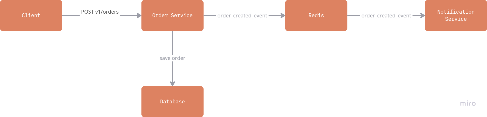
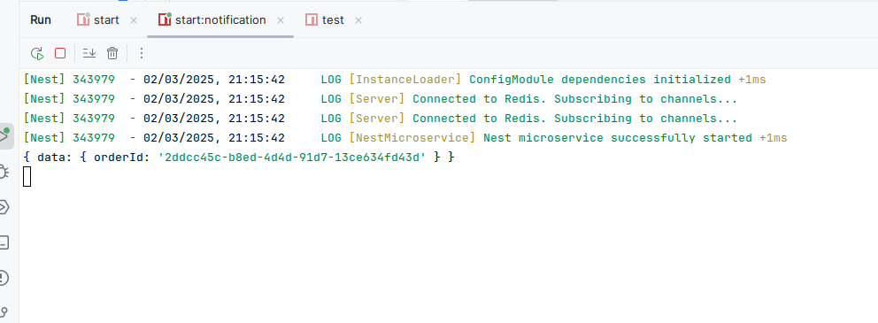

## Ecommerce poc with microservice integration

## Project setup

```bash
$ npm install
```

## Compile and run the project

```bash
# main project
$ npm run start

# notification microservice
$  npm run start notification --watch

```
## Documentation
Once you are running the project you can check documentation [here](http://localhost:3000/api)
## Run tests

```bash
# unit tests
$ npm run test
```
## E-commerce System Simulation
This project is a simple simulation of an e-commerce system featuring a POST v1/orders endpoint. It follows CQRS architecture and Domain-Driven Design (DDD) principles to maintain a clean and scalable structure.


Key Features
- CQRS & DDD: Implements a clear separation of commands and queries, following domain-driven design best practices.
- Infra layer implementation : Uses SQLite3 for entity and repository implementation, keeping the project lightweight and easy to set up.
- Message Communication: The main application communicates with the notification service using Redis, but this can be easily replaced with SQS, Kafka, or another messaging system.
- Authentication & Authorization: Integrated using Passport.js with NestJS, not fully implemented.
- Users Module: Currently works as a mock and is not fully implemented.
- Test: E2E for order endpoint added
- Notification service: Added just to log the event not fully implemented 
